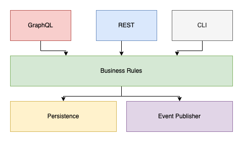

## Introduction

Have you heard of any of these software architectures? Ports and adapters, clean architecture, layered application, onion architecture, hexagonal, N-tiered, so on and so forth. Have you ever stared at one of these diagrams and thought “Yeah that makes sense, but how do I do it code?” I have as well, and I think it is a sentiment, at least in my experience, that many people share.

That’s why today we are demystifying software architecture (the backend part at least) down to a few basic principles and techniques. My goal is by the end of this article you will hopefully see that all of these architectures are essentially the same, and to paraphrase Bruce Lee “The only style is no style”.

## Dedicated business logic layer

The foundational building block in all of these architectures is a dedicated business logic layer. So let us start there.

What *is* business logic? It’s is the brains behind your application that fulfills use cases. What is a use case? Well its the thing you are trying to do. For example if we have a social media application, we might want to have the ability to “like” a post. So somewhere in our code we could have a function called `likePost` or something like that.

Riffing on this `likePost` example, what are some requirements for this? We probably need to store some object (lets call it `PostLike` ) and link it back to the `Post` object. This would allow us to denote that the post has in fact been liked. `PostLike` should probably also include who liked the post. Maybe we’d like to know when the `Post` was liked. What happens if the `Post` doesn’t exist? Should we verify that before creating this `PostLike` object? Do other parts of the application need to be notified that someone liked a post? 

Some of these are explicitly required while some are implicitly required so that we save our ass so things don’t go sideways. In either case we can write tests for these things and ensure that our use cases **behave** in the manor we expect. These are the business rules.

Notice that thus far I haven’t mentioned `SQL`, `DynamoDb`, `RabbitMQ`, `REST`, `GraphQL`, or any other technology for that matter. At this level we simply do not care. We are most concerned with “what” the behavior of the use case is, not “how” its going to happen. The business logic layer helps us drive **behaviors** and technology solutions *do not* fit within that category.

Still, we are going to need to figure that part out if we are going to do anything useful with the business rules. This is a perfect segue into the next principle/technique.

## Dependency inversion

If you are familiar with SOLID design principles, this is “D” part in the acronym and its states that

> High level modules should not depend on low level modules; 
both should depend on abstractions. Abstractions should not depend on 
details.  Details should depend upon abstractions.
> 

While it is the official and accurate definition, in my opinion the language is much too complicated. It sounds scary. So what does dependency inversion actually mean?

All it means is that instead of calling another function or method directly, you pass it in as an argument instead. So if you are working with classes in an object oriented language you would typically pass in some dependency through the constructor. If you are working with a language that supports first class functions, you would pass in a function as an argument to create a higher order function.

Recall in the previous section that the business rules are looking to answer “what” not “how”, so one caveat is that these function signatures that we are passing in need to be agnostic of the underlying implementation. For example lets say we need to persist our `PostLike` to some data store. We might do this with a function called `save` that takes in a `PostLike` object and returns the same object once it have been successfully persisted. Underneath the hood it could be writing to a `Postgres` database or maybe even the file system.

The benefit of passing in these dependencies is that it effectively decouples the business rules from any specific technology(aka loose coupling). Said differently this is the glue that holds everything together with the business rules. And its what allows us to tune the “what” and the “how” separately. We can change one without effecting the other.

## Show me the code

Okay now that we’ve gotten the high-level stuff out of the way, lets dive into an example so we can see what this looks like in practice. We’ll layout the code for our `likePost` use case and discuss on the other side. 

```typescript
interface PostLike {
  accountId: string;
  postId: string;
  timestamp: number;
}

type DoesPostExist = (postId: string) => Promise<boolean>;
type Save<T> = (entity: T) => Promise<T>;
type PublishEvent<T> = (event: T) => Promise<void>;

const likePost = async ({
  accountId,
  postId,
  doesPostExist,
  save,
  publishPostLikedEvent,
}: {
  accountId: string;
  postId: string;
  doesPostExist: DoesPostExist;
  save: Save<PostLike>;
  publishPostLikedEvent: PublishEvent<PostLike>;
}): Promise<{ result: PostLike }> => {
  const postExists = await doesPostExist(postId);
  if (!postExists) {
    throw new Error('cannot like post that does not exist...');
  }

  const result = await save({ accountId, postId, timestamp: Date.now() });

  await publishPostLikedEvent(result);

  return { result };
};
```

Okay so here we are! We have our `likePost` function that takes in an `accountId` and a `postId` so that we can say that the account liked the post. In addition we have a couple of functions that we have passed in to help us flush out our use case. The `doesPostExist` function (presumably supplied by the domain that handles `Posts`) will let us know if the supplied `postId` is valid or not. We have a `save` function that will handle the persistence of the `PostLike` and finally a `publishPostLikedEvent` function that will notify stuff downstream that this has happened.

We defined types for these functions but we did not define implementations. With our implementations of these functions (*shown off camera*) we are free to choose whatever technologies we’d like. For example we could write an implementation for `publishPostLikedEvent` that uses `SQS` , `SNS` , or `RabbitMQ`. 

A good rule of thumb is if a function returns a `Promise` just pass it in. Your unit tests will also thank you.

## Diagram it

Despite what shape its presented in (hexagon, concentric circles, or boxes), the concept is the same. On the outside we have technology concerns and in the middle we have the actual business rules. For simplicity’s sake, lets look at a layered application diagram (the boxes) that fits with `likePost` example above.



Everything above the business rules is usually some sort of facade or way to access the business rules. For example we could write a `REST` api, `GraphQL` , or even a `CLI` . Sometimes you’ll see this referred to as the `I/O` layer.

Below the business rules are other potential layers driven by the business rules. We may need persistence, we may need to talk to another micro-service, third-party api, or what have you, and we may also need to publish an event to let other parts of the system know whats going on. 

These are fluid and can change on a case-by-case basis.

## Recap

- The foundational pieces of software architectures are the behaviors that make up use cases.
- We can isolate these behaviors in a dedicated business logic layer.
- Dependency inversion is used to glue everything(layers) together.
- Using these techniques together separates “what” from “how” and allows the system to evolve naturally.
- Most popular software architectures work to achieve this although there are nuances between them.

> Because of styles people are separated. Research your own experience, absorb what is useful, reject what is useless, add what is essentially your own.  -- Bruce Lee
> 

Thanks for reading!